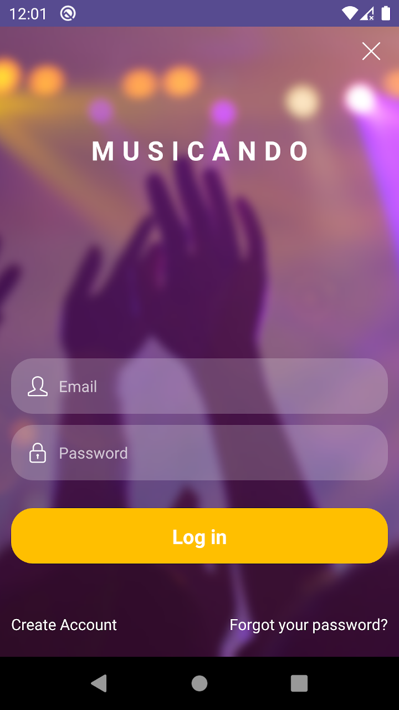
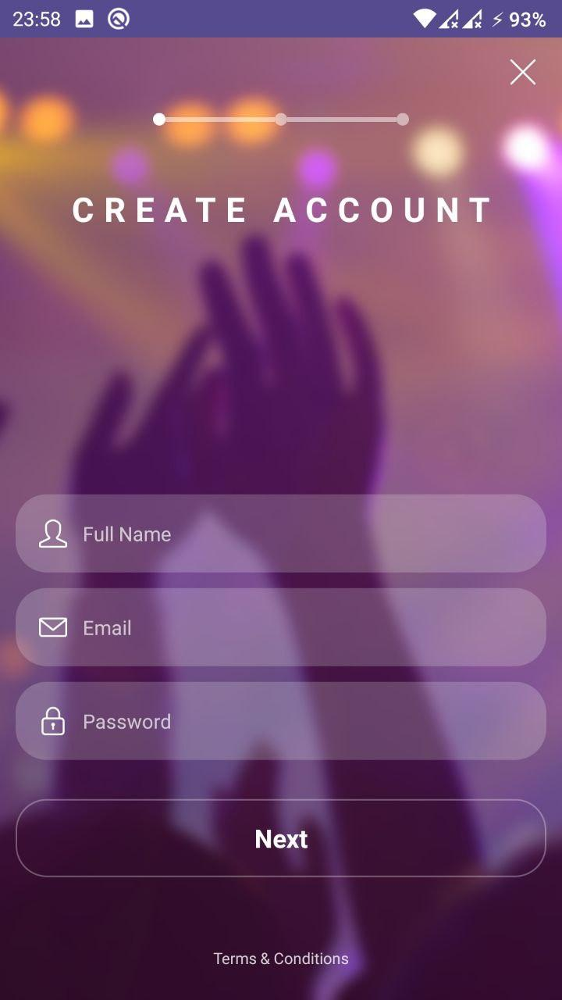

# Musicando APP with React Native

### How to run in your machine

```
yarn install && yarn android
```

### How to build a new release

#### Generating an upload key

```
$ keytool -genkeypair -v -keystore my-upload-key.keystore -alias my-key-alias -keyalg RSA -keysize 2048 -validity 10000
```

- Move "my-upload-key.keystore" to android/app;
- Create the .env file from .env.template and add your STORE_PASSWORD and KEY_PASSWORD used in keytool;
- now run `yarn build:release`
- The APK is localized in **android/app/build/outputs/apk/release**.

More details to build [here](https://reactnative.dev/docs/signed-apk-android.html).

# `WORK IN PROGRESS`

tested only in Android

# Screenshots




